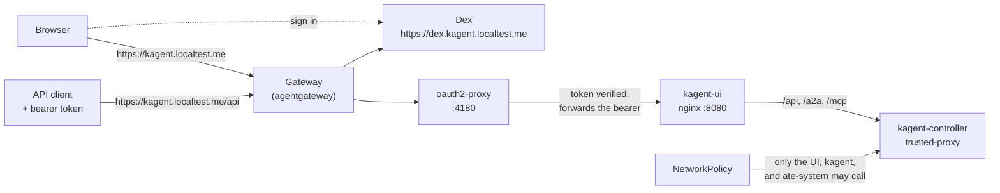

# kagent with sign-in: trusted-proxy mode behind agentgateway

Run [kagent](https://kagent.dev) 1.x with real user identity, the way its own architecture doc describes. People sign in through an OIDC identity provider. [oauth2-proxy](https://oauth2-proxy.github.io/oauth2-proxy/) (bundled in the kagent chart) checks the sign-in and every bearer token. The controller runs in `trusted-proxy` mode and takes the user from the token. agentgateway, through the Gateway API, terminates TLS and publishes the sign-in and the app. NetworkPolicies keep everything else away from the controller.

The kagent docs describe this design in `docs/architecture/oidc-proxy-authentication.md` in the kagent repository, but they stop short of a working setup. This example builds one, with a small identity provider (Dex) so that you can run it anywhere, and lists what it does and does not give you.

## How it works



- **There is one public door for kagent.** `kagent.localtest.me` goes to oauth2-proxy and nowhere else. The UI Service and the controller have no route of their own, which is what the kagent doc asks for.
- **oauth2-proxy is the boundary that verifies.** It signs browsers in with a session cookie, and it verifies the signature and expiry of bearer tokens from API clients (`skip-jwt-bearer-tokens`). The controller does not verify anything. The doc says its authenticator "decodes bearer JWT payloads without verifying signatures or expiry".
- **The user comes from the token.** `controller.auth.userIdClaim: email` makes the controller take the user from the `email` claim. The UI's nginx always removes `X-User-Id` and `X-Agent-Name` from outside requests in this mode, so a caller cannot choose another user.
- **The NetworkPolicies are not optional.** Because the controller trusts what reaches it, anything that can connect to it can claim to be any user. I tested this: a pod in another namespace sent an unsigned token that claimed to be `admin@kagent.dev` straight to the controller, and got the admin's sessions. The chart does not ship these policies.
- **Dex is told apart from the app by name.** The browser reaches Dex at `dex.kagent.localtest.me`, and oauth2-proxy reaches it inside the cluster. `extraArgs` in `kagent-values.yaml` gives oauth2-proxy both addresses.

## What it does not give you

I tested these, and they matter:

- **Authorization is not enforced.** Authentication and a default per-user view work. Between users, nothing is enforced. A signed-in user can set a field in the UI's own `ListSessions` request and get every user's sessions. The kagent doc says authorization "still defaults to `NoopAuthorizer`".
- **The `kagent` CLI does not work.** In this mode it fails with `Unauthenticated: invalid credentials`, because it sends a user ID and no token. Use the UI.
- **The controller's own `kagent-api` MCP server loses its tools.** It fails with `Unauthorized`, and its 18 tools are not discovered. The other MCP servers are not affected.
- **The agents work.** A signed-in user can chat with an agent, and a 45 second turn streams through oauth2-proxy without being cut.

## Layout

| Path | What it is |
| :--- | :--- |
| `gateway.yaml` | The `gateway-system` namespace and a `Gateway` with one HTTPS listener, open to routes from `kagent` and `idp` |
| `idp.yaml` | Dex with two static users (`alice` and `bob`), in the `idp` namespace. A stand-in for your identity provider |
| `kagent-values.yaml` | Helm values: `trusted-proxy` mode, the user claim, and the bundled oauth2-proxy |
| `routes.yaml` | `HTTPRoute`s for `kagent.localtest.me` (to oauth2-proxy) and `dex.kagent.localtest.me` (to Dex) |
| `network-policy.yaml` | NetworkPolicies for the UI and the controller |
| `scripts/smoke-test.sh` | Checks anonymous access, tokens, identity, header spoofing, and the NetworkPolicy |
| `scripts/browser-check.mjs` | Signs in through Dex in Chrome and runs a turn longer than 15 seconds |

## Before you start

- A Kubernetes cluster running kagent 1.x, installed as in the [kagent installation guide](https://kagent.dev/docs/kagent/1.x/setup/installation/), with at least one Agent in the `kagent` namespace. I tested on kagent 1.0.0-alpha7 with agents running on Agent Substrate.
- A CNI that enforces NetworkPolicy. I used `kind` with its default `kindnet`, and it does.
- On your machine: `kubectl`, `helm`, `openssl`, `htpasswd`, `python3`, `jq`, and `curl`. For the browser check you also need `node` and Chrome.

This example changes your controller's auth mode. Once it is on, the `kagent` CLI stops working until you switch back. Try it on a cluster you can spare.

## Run it

1. Install Gateway API and agentgateway. Any Gateway API implementation can serve `routes.yaml`. If you use an Envoy-based one, raise its route timeout, because it cuts a response at 15 seconds by default.

   ```bash
   kubectl apply --server-side --force-conflicts -f \
     https://github.com/kubernetes-sigs/gateway-api/releases/download/v1.6.0/standard-install.yaml
   helm upgrade -i agentgateway-crds oci://cr.agentgateway.dev/charts/agentgateway-crds \
     --create-namespace --namespace agentgateway-system --version v1.6.0
   helm upgrade -i agentgateway oci://cr.agentgateway.dev/charts/agentgateway \
     --namespace agentgateway-system --version v1.6.0 --wait
   ```

2. Make a certificate and the Gateway. The certificate is self-signed and covers both hostnames. Use cert-manager or your own CA in a real cluster. On `kind` the gateway is reached through a port-forward on 8443, so the public URLs carry `:8443`. On a cluster with a load balancer on 443, set `PORT_SUFFIX=""` instead.

   ```bash
   export PORT_SUFFIX=":8443"

   openssl req -x509 -newkey rsa:2048 -nodes -days 30 -keyout tls.key -out tls.crt \
     -subj "/CN=kagent.localtest.me" \
     -addext "subjectAltName=DNS:kagent.localtest.me,DNS:dex.kagent.localtest.me"

   kubectl apply -f gateway.yaml
   kubectl create secret tls kagent-tls -n gateway-system --cert=tls.crt --key=tls.key
   ```

3. Start the identity provider. The client secret goes into Dex's configuration and into the Secret that oauth2-proxy reads, so make it once. The cookie secret must be URL-safe base64. A standard base64 value with a `+` or `/` in it makes oauth2-proxy refuse to start (see the notes below).

   ```bash
   CLIENT_SECRET=$(openssl rand -hex 24)
   hash() { htpasswd -bnBC 10 "" "$1" | tr -d ':\n' | sed 's/^\$2y/$2a/'; }

   sed -e "s|__PORT__|$PORT_SUFFIX|g" -e "s|__CLIENT_SECRET__|$CLIENT_SECRET|" \
       -e "s|__ALICE_HASH__|$(hash alice-pass)|" -e "s|__BOB_HASH__|$(hash bob-pass)|" idp.yaml | kubectl apply -f -

   kubectl create secret generic kagent-oidc -n kagent \
     --from-literal=client-id=kagent \
     --from-literal=client-secret="$CLIENT_SECRET" \
     --from-literal=cookie-secret="$(openssl rand -base64 32 | tr -d '\n' | tr '+/' '-_')"

   kubectl -n idp rollout status deploy/dex
   ```

   `idp.yaml` is a template, so no secret lives in the repository. The `sed` command fills four placeholders before `kubectl apply` reads the file from stdin:

   - `__PORT__` becomes `$PORT_SUFFIX`. Dex's issuer is a public URL with the gateway's port in it, and it must match the issuer oauth2-proxy expects exactly. `kagent-values.yaml` in step 4 uses the same placeholder.
   - `__CLIENT_SECRET__` becomes the random secret. Dex and the `kagent-oidc` Secret get the same value, which is how oauth2-proxy proves who it is to Dex.
   - `__ALICE_HASH__` and `__BOB_HASH__` become bcrypt hashes of the two passwords, because Dex stores static passwords only as hashes. The `hash` function strips the `:` and newline that `htpasswd` prints, and changes its `$2y$` prefix to `$2a$`, the form Dex's examples use.

   The Secret also holds the client ID, which must equal the client `id` in `idp.yaml`, and a cookie secret that oauth2-proxy uses to encrypt the session cookie.

4. Switch kagent to `trusted-proxy` and turn on oauth2-proxy. `--reuse-values` keeps your providers and keys.

   ```bash
   sed "s|__PORT__|$PORT_SUFFIX|g" kagent-values.yaml | \
     helm upgrade kagent oci://ghcr.io/kagent-dev/kagent/helm/kagent --version 1.0.0-alpha7 \
       -n kagent --reuse-values -f -
   kubectl -n kagent rollout status deploy/kagent-oauth2-proxy deploy/kagent-controller
   ```

5. Publish it, and close the side doors.

   ```bash
   kubectl apply -f routes.yaml -f network-policy.yaml
   ```

6. Reach the gateway. With a load balancer, point DNS at its address. On `kind`, forward the Service. `*.localtest.me` names resolve to `127.0.0.1`, so the hostnames work from a browser.

   ```bash
   kubectl -n gateway-system port-forward svc/kagent 8443:443 &
   npm install --prefix scripts          # once, for the browser check
   CACERT=tls.crt ./scripts/smoke-test.sh   # set AGENT=<name> to pick the agent
   ```

   You should see this:

   ```text
   agent: kagent/claude
   == anonymous callers
   ok   the UI is not served to an anonymous caller (403)
   ok   the API is not served to an anonymous caller (403)
   ok   sign-in redirects to the identity provider
   == tokens
   ok   a forged token is refused at the proxy (403)
   ok   a token from the identity provider is accepted (200)
   == a person signs in and runs a turn longer than 15 seconds
   ok   sign-in redirects to the identity provider
   ok   signed in as alice@example.com
   turn took 35s
   ok   a 35s turn finished with no error
   == who the controller thinks the caller is
   ok   alice sees her own sessions (alice@example.com)
   ok   bob does not see alice's sessions (saw: bob@example.com)
   ok   bob cannot become alice with X-User-Id (saw: bob@example.com)
   ok   bob cannot pick the agent path with X-Agent-Name (saw: bob@example.com)
   note bob can list alice's sessions with the request the UI sends (admin@kagent.dev alice@example.com bob@example.com). Authorization is not enforced in this kagent version
   == a pod in another namespace
   ok   a forged token cannot reach the controller from another namespace
   PASS: anonymous callers are refused, identity is real, spoofed headers are ignored, and the controller is not reachable around the proxy
   ```

   Your output will differ in the names it lists. Here `bob` already had a session from earlier testing, and on a new cluster those lines say `saw: none`. The last `note` line lists the sessions of every user that exist on the cluster. It is the known authorization gap, not a failure.

Open `https://kagent.localtest.me:8443`, choose the sign-in, and use `alice@example.com` with `alice-pass`, or `bob@example.com` with `bob-pass`. The browser warns about the certificate unless you trust `tls.crt`.

## Notes

- **The cookie secret must be URL-safe.** The kagent doc says to use "a random 32-byte key, base64 encoded". oauth2-proxy reads the value as raw text unless it decodes as URL-safe base64, and the standard alphabet's `+` and `/` break that. It then fails with `cookie_secret must be 16, 24, or 32 bytes ... but is 44 bytes`. Whether a key breaks depends on the random bytes. The command above swaps `+/` for `-_`.
- **The oauth2-proxy Service is on port 4180.** The subchart's own values suggest 80.
- **Dex needs `/healthz`.** Its `/healthz/ready` path is on a different, optional server, and the readiness probe gets a 404.
- **Anonymous requests get a 403, not a redirect.** The chart lets the UI's `/login` page through, and the UI sends the browser to `/oauth2/start`. That is where the redirect to the identity provider happens.
- **API clients use the same hostname.** The UI speaks gRPC-web to `/api/...`, including `lf.a2a.v1.A2AService/SendStreamingMessage` for chat. A client with an ID token from your identity provider can call the same paths with `Authorization: Bearer ...`. I tested this with `ListSessions`, and did not build a client that sends a chat message.
- **The UI shows an opaque ID in its header.** It displays Dex's `sub` claim, a long encoded string, and not the email. The controller uses the `email` claim, so sessions are still owned by `alice@example.com`.
- **"The agent could not finish this turn" after sign-in works is usually the agent, not the gateway.** The check signs in and reaches the controller (the UI shows your chats and the stream returns a `gap-auth` header with your email), so an error there comes from the agent runtime. For a Substrate agent, a message like `input was not accepted; retry after the session becomes available` (gRPC `FailedPrecondition`) can follow a restart of the cluster or Docker: the controller log in `ate-system` then warns `registered worker IP disagrees with its pod`, because the worker pods came back with different IPs. Restarting the worker pool (`kubectl rollout restart deploy/kagent-default -n kagent`) clears the error, and it ends any running agent sessions. Run the smoke test again after the pods are ready.
- **Dex runs with in-memory storage.** Restarting it ends all sessions. Use a real database or your own identity provider outside a lab.

## Clean up

```bash
kubectl delete -f network-policy.yaml -f routes.yaml --ignore-not-found
helm upgrade kagent oci://ghcr.io/kagent-dev/kagent/helm/kagent --version 1.0.0-alpha7 \
  -n kagent --reuse-values --set controller.auth.mode=insecure --set oauth2-proxy.enabled=false
kubectl delete secret kagent-oidc -n kagent
kubectl delete -f gateway.yaml
kubectl delete namespace idp
```

`--reuse-values` keeps the values from step 4 in the release config, inactive. If you want the release exactly as it was, run `helm history kagent -n kagent`, and then `helm rollback kagent <the revision before step 4> -n kagent`.

Leave agentgateway installed if you use it for anything else. To remove it, run `helm uninstall agentgateway agentgateway-crds -n agentgateway-system`.
