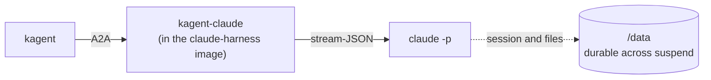

# Claude Code on kagent and Agent Substrate: a migration from OpenShell

Move the Claude Code setup from the NVIDIA [OpenShell GitHub Push Access tutorial](https://docs.nvidia.com/openshell/tutorials/github-push-access) to [kagent](https://kagent.dev) 1.x and Agent Substrate. kagent ships a Claude runtime, so there is no adapter and no image to build: the migration is configuration. Idle agents suspend to a snapshot and free their worker, then resume on the next message with the conversation intact.

It is part of [kagent-examples](../README.md). For an agent without a built-in runtime, see the sibling example [`pi-agent`](../pi-agent/), which needs an A2A adapter.

## What maps to what

| OpenShell tutorial | This example |
| :--- | :--- |
| Image with Claude Code, `git`, `gh` | The `claude-harness` image from kagent, pinned by digest, in `claude.yaml` |
| `provider create --type claude-code` | `Secret` `kagent-anthropic` and `modelconfig-anthropic.yaml` |
| `provider create --type github` and the push policy | `github-push.yaml`: a GitHub `RemoteMCPServer` with the token injected by the gateway, and `requireApproval: true` |
| `sandbox create ... -- claude` | `claude.yaml` (`Harness`, `AgentTemplate`, `Agent`) and a session |
| `openshell logs` | `kubectl logs -n ate-system deploy/atenet-egress -c agentgateway` |

## How it works



- kagent compiles the `AgentTemplate` into Claude Code configuration and runs each turn in a Substrate actor. You supply no code.
- The Anthropic key and the GitHub token never enter the actor. The actor holds a placeholder (`kagent-credential-injected`), and the egress gateway swaps in the real value from a Kubernetes Secret on requests to `api.anthropic.com` and `api.githubcopilot.com`.
- Egress is default-deny. The allow-list comes from the model endpoint and MCP servers named in the template, so `git clone` from github.com fails with a 403, by design.
- With `requireApproval: true`, Claude pauses before each GitHub tool call. While it waits, the actor is `ACTOR_STATE_PAUSED` and holds no worker.

## Layout

| Path | What it is |
| :--- | :--- |
| `modelconfig-anthropic.yaml` | `ModelConfig` for Anthropic |
| `claude.yaml` | `Harness`, `AgentTemplate`, and `Agent` for Claude Code |
| `github-push.yaml` | GitHub `RemoteMCPServer`, and the template updated with it and an approval gate |
| `scripts/smoke-test.sh` | Runs a turn, waits for suspend, resumes, checks recall, file persistence, and the egress denial |
| `scripts/push-test.sh` | Pushes a file to a branch through GitHub, rejecting once and approving the retry |
| `scripts/approve.sh` | Approve, reject, or list pending tool approvals for a session |
| `TROUBLESHOOTING.md` | Fixes for the errors you are most likely to hit |

## Prerequisites

- The base setup from the [repo README](../README.md#prerequisites): a cluster with Agent Substrate and kagent 1.x installed, plus `kubectl`, the `kagent` CLI, `kubectl-ate`, and `jq`.
- An [Anthropic API key](https://console.anthropic.com/).
- For the GitHub part: a throwaway repository, a fine-grained personal access token with read and write access to only that repository, and `gh` to check the result.

## Quickstart

```bash
# 1. Secret and model. If you installed kagent with
#    providers.default=anthropic, the Secret already exists and you can skip it.
export ANTHROPIC_API_KEY=<your Anthropic key>
kubectl create secret generic kagent-anthropic -n kagent \
  --from-literal ANTHROPIC_API_KEY="$ANTHROPIC_API_KEY"
kubectl apply -f modelconfig-anthropic.yaml

# 2. The agent
kubectl apply -f claude.yaml
kagent agent get claude        # wait for READY = True; the first time takes a minute or two

# 3. Try it
kubectl port-forward -n kagent svc/kagent-controller 8083:8083 &
./scripts/smoke-test.sh
```

The smoke test creates a session, asks Claude to write a file, waits for the actor to suspend, resumes it with a question that only works if Claude Code's session came back, and checks that github.com is denied. A passing run looks like this:

```text
== turn 1: create a file
I created `/data/workspace/substrate7702.txt` containing the word substrate7702.
actor: ACTOR_STATE_SUSPENDED <none>
== turn 2: resume, recall, and read the file back
You asked for `substrate7702.txt`, and `cat` shows it contains just the word "substrate7702".
actor: ACTOR_STATE_SUSPENDED <none>
== turn 3: egress is default-deny
It failed. The error line is: `remote: actor egress policy denied TLS destination`
PASS: suspend, resume, file persistence, and default-deny egress all work
```

To chat with the agent yourself, create a session and send tasks to it:

```bash
export SESSION_ID=$(kagent agent session create --agent claude -o json | jq -r '.session.id')
kagent agent invoke --session $SESSION_ID --task "Create hello.txt with a one-line greeting"
kagent agent session delete $SESSION_ID
```

## GitHub push with approval

Use a repository you can throw away, and a fine-grained token limited to it.

```bash
export GITHUB_TOKEN=<your fine-grained token>
kubectl create secret generic github-mcp-auth -n kagent \
  --from-literal Authorization="Bearer $GITHUB_TOKEN"
kubectl apply -f github-push.yaml
kubectl get remotemcpserver github-mcp -n kagent -o jsonpath='{.status.discoveredTools[*].name}'
# create_branch create_or_update_file get_file_contents push_files

./scripts/push-test.sh <owner>/<repo>
```

To drive it by hand, send the task with `kagent agent invoke`. The CLI stops at the first approval gate and prints `Claude requires approval before calling ...`. Then:

```bash
./scripts/approve.sh $SESSION_ID pending                     # see the tool and its arguments
./scripts/approve.sh $SESSION_ID                             # approve
./scripts/approve.sh $SESSION_ID reject "Use hello.py"       # or reject, with a reason
```

The kagent UI shows the same pending requests. The script sends the same A2A message over JSON-RPC, so you can automate it.

The repository boundary is your token's scope. The gateway scopes the credential by host and header, not by URL path, and the approval request shows you the repository, branch, and file before you decide.

## Configuration

| Setting | Where | Notes |
| :--- | :--- | :--- |
| Model | `model:` in `modelconfig-anthropic.yaml` | Any Claude model your key can use. Keep `anthropic: {}` empty: the Claude runtime accepts no Anthropic options beyond `baseUrl` and rejects `promptCaching`. |
| `CLAUDE_CODE_DISABLE_NONESSENTIAL_TRAFFIC=1` | `claude.yaml` `Harness` env | Turns off Claude Code's nonessential calls (telemetry, error reporting, and others). Without it, default-deny egress blocks a call to Datadog's log intake with a 403, which is harmless but noisy in the gateway logs. |
| `X-MCP-Tools` | `github-push.yaml` header | GitHub filters the tool list on the server side. The Claude runtime binds a whole MCP server, so this is how you narrow it. |
| `requireApproval` | `github-push.yaml` template | Applies to every tool on the server, reads included. |

## Clean up

```bash
kubectl delete -f github-push.yaml -f claude.yaml -f modelconfig-anthropic.yaml --ignore-not-found
kubectl delete secret github-mcp-auth -n kagent --ignore-not-found
kubectl delete secret kagent-anthropic -n kagent   # only if you created it yourself, not the Helm chart
```

`github-push.yaml` and `claude.yaml` both define `claude-template`, so deleting either removes it. Delete any sessions you created with `kagent agent session delete <id>`, because an open session keeps its snapshot in object storage until you delete it, or until it has had no task activity for seven days (the default idle expiry).

## Tested with

Validated end to end on 2026-10-07 on a local `kind` cluster (Kubernetes 1.37.0, arm64).

| Component | Version |
| :--- | :--- |
| Substrate (`substrate`, `substrate-crds` charts) | 0.3.0-alpha3 |
| kagent (`kagent`, `kagent-crds` charts) and CLI | 1.0.0-alpha7 |
| Worker image | `ghcr.io/kagent-dev/substrate/ateom-gvisor:v0.3.0-alpha3` |
| Claude harness image | `ghcr.io/kagent-dev/kagent/claude-harness:1.0.0-alpha7` (`sha256:1bce31de...`, multi-arch) |
| Claude Code (in the image) | 2.1.260 |
| Model | `claude-sonnet-5-5` |

What was run:
- All manifests applied to the live CRDs and compiled. The agent reached `READY`.
- `scripts/smoke-test.sh` passed: suspend after each turn, recall and file persistence on resume, and a 403 for `git clone` from github.com.
- `scripts/push-test.sh` passed against a throwaway private repository: a branch and a file pushed through the GitHub MCP server, with one rejection and the approvals.
- Inside a running actor, `ANTHROPIC_API_KEY` and the GitHub MCP credential were both `kagent-credential-injected` placeholders.
- A pending approval left the actor `ACTOR_STATE_PAUSED` with no worker.

Not run:
- A wait of hours on a pending approval. Approvals were answered within seconds.
- A clean install of Substrate and kagent. The test cluster already had them. The chart values for `providers.default: anthropic` were checked with `helm template` only.
- A fine-grained GitHub token. The test used a broader token against a throwaway repository.
- Approving from the kagent UI. Approvals went through `scripts/approve.sh`.
- The alpha8 CLI and Substrate 0.4.0-alpha1.

These are alpha releases, so the pins will drift. Check the [kagent 1.x docs](https://kagent.dev/docs/kagent/1.x/) for current versions.

## Troubleshooting

See [TROUBLESHOOTING.md](TROUBLESHOOTING.md).

## Notes

- The actor runs as root (uid 0) inside its gVisor sandbox. Claude Code runs with `--dangerously-skip-permissions` and `IS_SANDBOX=1`, set by the harness: the boundary is the actor and the egress policy, not Claude's own permission prompts.
- The image is Alpine with Claude Code, `git`, `ripgrep`, and `bash`. There is no `gh`, Python, or Node. Building on top of it for a custom toolchain was not tried.
- The Claude runtime does not support picking individual tools from an MCP server, and it does not yet let you set Claude Code's permission mode in the Harness.

## License

Licensed under the [Apache License, Version 2.0](../LICENSE).
