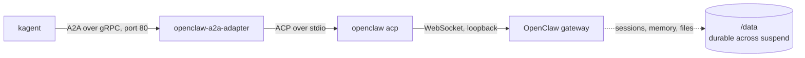

# OpenClaw on kagent and Agent Substrate

Run [OpenClaw](https://openclaw.ai) on [kagent](https://kagent.dev) 1.x and Agent Substrate. OpenClaw keeps its own agent loop, workspace, memory, and skills. kagent and Substrate take the lifecycle and the isolation, and an agentgateway decides which tools it can see. Idle agents suspend to a snapshot and free their worker, then resume on the next message with the conversation and the workspace intact.

This is the kagent 1.x version of the setup in Tom O'Rourke's post, [Running OpenClaw 2.0 as a kagent AgentHarness on Agent Substrate](https://mastertheagent.com/solo/agent-harness-openclaw-kind/), which used kagent 0.10.1. kagent 1.0 removed `AgentHarness` and its `openclaw` backend with no replacement, so this example runs OpenClaw as a bring-your-own `Harness` instead, behind a small adapter. It is part of [kagent-examples](../README.md). The other bring-your-own example, [`pi-agent`](../pi-agent/), uses the same pattern for a different agent.

## What maps to what

| In the kagent 0.10.1 post | In this example |
| :--- | :--- |
| `AgentHarness` with `backend: openclaw` | A `byo` `Harness`, an `AgentTemplate`, and an `Agent` (`openclaw.yaml`) |
| kagent's `acp-sandbox-openclaw` image, which carries OpenClaw 2026.5.27 | An image you build from npm (`Dockerfile.openclaw`), pinned to OpenClaw 2026.9.9 |
| ACP over a controller WebSocket, to an `acp-shim` in the actor | kagent speaks A2A to every agent, so `openclaw-a2a-adapter` bridges A2A to `openclaw acp` |
| One shared actor for every chat session of a harness | One actor per session, which suspends when idle |
| `ModelConfig` with `provider: OpenAI` to work around a missing `maxTokens`, through agentgateway | A normal `provider: Anthropic` `ModelConfig`. Substrate's egress gateway injects the key |
| agentgateway on the model path | Not needed: the egress gateway already holds the only provider key |
| `openclaw mcp set` run over ACP to register a tool server | A `RemoteMCPServer` in the `AgentTemplate`. The adapter writes OpenClaw's MCP registry |
| agentgateway on the tool path, with a four-tool allow-list | The same, unchanged (`tools-gateway.yaml`) |
| Exec approval over ACP | The task pauses in `INPUT_REQUIRED`, and the actor in `ACTOR_STATE_PAUSED` |
| Changing `modelConfigRef` re-created the harness and deleted the workspace | Each session has its own actor and its own `/data` |

## How it works



- The adapter uses kagent's shared harness executor, the same one kagent's Claude and Codex runtimes use. It handles streaming, task state, and pausing a task. The adapter supplies a `Runner` that turns an A2A message into an ACP `session/prompt` and maps ACP updates back to text and tool events.
- When OpenClaw asks to approve an `exec` command (`session/request_permission`), the adapter parks the turn and kagent shows an approval request. While it waits, Substrate pauses the actor with a full snapshot, so the pending turn survives. Approve or reject, and the same turn continues.
- The adapter writes OpenClaw's `openclaw.json` from the `AgentTemplate` kagent compiled: the model, the MCP servers, and the system prompt, which becomes `AGENTS.md` in the workspace.
- The Anthropic key never enters the actor. The actor holds the placeholder `kagent-credential-injected`, and the egress gateway swaps in the real key from a Kubernetes Secret on requests to `api.anthropic.com`.
- OpenClaw starts on the first turn, not before the actor reports ready. A suspended actor resumes from its golden snapshot with `/data` replaced by the saved copy, so an OpenClaw running at snapshot time would hold files that were swapped under it.
- Every turn uses one OpenClaw session key. OpenClaw keeps the transcript in `/data/openclaw`, so a gateway started after a resume continues the same conversation.

## Layout

| Path | What it is |
| :--- | :--- |
| `adapter/` | The A2A-to-OpenClaw adapter, with unit tests and integration tests against a real OpenClaw |
| `Dockerfile.openclaw` | Builds the adapter, then installs OpenClaw from npm on `node:24-bookworm-slim` |
| `modelconfig-anthropic.yaml` | `ModelConfig` for Anthropic |
| `openclaw.yaml` | `Harness`, `AgentTemplate`, and `Agent` for OpenClaw |
| `sre-lab.yaml` | A namespace with three healthy workloads and four broken ones |
| `tools-gateway.yaml` | A `Gateway`, a backend for `kagent-tools`, and a policy that publishes four read tools |
| `sre-tools.yaml` | The gateway as a `RemoteMCPServer`, and the template updated to use it |
| `scripts/smoke-test.sh` | Runs a turn, waits for suspend, resumes, and checks recall and the file |
| `scripts/sre-test.sh` | Investigates `sre-lab` through the four tools, then asks for a change it has no tool for |
| `scripts/approve.sh` | Approves, rejects, or lists pending approvals for a session |
| `scripts/mcp-list.py` | Lists the tools an MCP server publishes |
| `TROUBLESHOOTING.md` | Fixes for the errors you are most likely to hit |

## Prerequisites

- The base setup from the [repo README](../README.md#prerequisites): a cluster with Agent Substrate and kagent 1.x installed, plus `kubectl`, the `kagent` CLI, `kubectl-ate`, and `jq`.
- An [Anthropic API key](https://console.anthropic.com/).
- Memory: the OpenClaw gateway uses about 1 GB while an actor runs. Each running actor holds a worker, and each one runs its own gateway.
- For the tool part: `helm`, to install agentgateway.

## Quickstart

```bash
# 1. Secret and model. If you installed kagent with
#    providers.default=anthropic, the Secret already exists and you can skip it.
export ANTHROPIC_API_KEY=<your Anthropic key>
kubectl create secret generic kagent-anthropic -n kagent \
  --from-literal ANTHROPIC_API_KEY="$ANTHROPIC_API_KEY"
kubectl apply -f modelconfig-anthropic.yaml

# 2. The agent
kubectl apply -f openclaw.yaml
kagent agent get openclaw      # wait for READY = True; the first time takes under a minute

# 3. Try it
kubectl port-forward -n kagent svc/kagent-controller 8083:8083 &
./scripts/smoke-test.sh
```

The smoke test creates a session, asks OpenClaw to write a file, waits for the actor to suspend, then resumes it with a question that only works if OpenClaw's session and workspace came back. A passing run looks like this:

```text
== turn 1: create a file
I created `substrate24389.txt` in `/data/workspace`, and it contains the word substrate24389.
actor: ACTOR_STATE_SUSPENDED <none>
== turn 2: resume, recall, and read the file back
You asked for `substrate24389.txt`, and it contains just the word "substrate24389".
actor: ACTOR_STATE_SUSPENDED <none>
PASS: suspend, resume, conversation restore, and file persistence all work
```

To chat with the agent yourself, create a session and send tasks to it:

```bash
export SESSION_ID=$(kagent agent session create --agent openclaw -o json | jq -r '.session.id')
kagent agent invoke --session $SESSION_ID --task "Create hello.txt with a one-line greeting"
kagent agent session delete $SESSION_ID
```

### Use your own image

`openclaw.yaml` points at a prebuilt, public, multi-arch image (`linux/amd64` and `linux/arm64`), `hguerrero0/openclaw-agent`. Building your own means you run exactly what is in this repo, and you control the OpenClaw version:

```bash
docker build -t <registry>/openclaw-agent:0.1 -f Dockerfile.openclaw .
docker push <registry>/openclaw-agent:0.1
docker inspect --format='{{index .RepoDigests 0}}' <registry>/openclaw-agent:0.1
```

Put the printed `<registry>/openclaw-agent@sha256:...` reference in the `workload.image` field of `openclaw.yaml`. Substrate pins images by digest, so a tag or a local image will not work. Pin OpenClaw with `--build-arg OPENCLAW_VERSION=<version>`. The adapter refuses to start outside kagent, because it needs the agent card and the compiled configuration that kagent supplies. That is expected.

## Approving commands

By default OpenClaw runs commands without asking, because the actor and its egress policy are the boundary. To approve each command, set `OPENCLAW_EXEC_MODE` to `ask` in the `Harness` env of `openclaw.yaml` and apply it. OpenClaw then pauses before any command that is not on its allowlist.

```bash
export SESSION_ID=$(kagent agent session create --agent openclaw -o json | jq -r '.session.id')
kagent agent invoke --session $SESSION_ID --task "Run hostname with your exec tool and tell me what it printed."
# OpenClaw asks to run the command: hostname
# Input required to continue this Session.

./scripts/approve.sh $SESSION_ID pending                  # see the command
./scripts/approve.sh $SESSION_ID                          # approve
./scripts/approve.sh $SESSION_ID reject "no shell here"   # or reject
```

While the request is pending, `kubectl ate get actors --atespace kagent` shows the actor as `ACTOR_STATE_PAUSED`, with no worker. A rejected command comes back to OpenClaw as `user-denied`. The reason text is not passed on, because ACP has no field for it.

An approval decides one command. It does not bound what OpenClaw can reach, and the original post saw OpenClaw reach the same result with another tool after a rejection. The boundary is the tool list and the egress policy.

## Tools through agentgateway

OpenClaw has its own MCP client, so the template binds a `RemoteMCPServer` and the adapter registers it. To keep the harness to four read tools, put `kagent-tools` behind an agentgateway that publishes only those. A tool that does not match the policy is not refused when called: it is missing from `tools/list`, so OpenClaw never sees it.

```bash
# agentgateway (see https://agentgateway.dev/docs/kubernetes/latest/quickstart/install/)
kubectl apply --server-side --force-conflicts -f \
  https://github.com/kubernetes-sigs/gateway-api/releases/download/v1.6.0/standard-install.yaml
helm upgrade -i agentgateway-crds oci://cr.agentgateway.dev/charts/agentgateway-crds \
  --create-namespace --namespace agentgateway-system --version v1.6.0
helm upgrade -i agentgateway oci://cr.agentgateway.dev/charts/agentgateway \
  --namespace agentgateway-system --version v1.6.0 --wait

kubectl apply -f tools-gateway.yaml
kubectl -n agentgateway-system wait gateway/tools-gateway --for=condition=Programmed --timeout=120s

kubectl -n agentgateway-system port-forward deploy/tools-gateway 18091:80 &
kubectl -n kagent port-forward svc/kagent-tools 18084:8084 &
python3 scripts/mcp-list.py http://127.0.0.1:18091/mcp               # through the gateway
# k8s_describe_resource  k8s_get_events  k8s_get_pod_logs  k8s_get_resources
python3 scripts/mcp-list.py http://127.0.0.1:18084/mcp | wc -l       # kagent-tools directly
# 126
```

Then deploy the broken namespace, bind the endpoint to the template, and run the test:

```bash
kubectl apply -f sre-lab.yaml
kubectl apply -f sre-tools.yaml
kubectl get remotemcpserver sre-tools -n kagent -o jsonpath='{.status.discoveredTools[*].name}'
# k8s_describe_resource k8s_get_events k8s_get_pod_logs k8s_get_resources

./scripts/sre-test.sh
```

OpenClaw finds all four broken workloads: `checkout` (missing `DATABASE_URL`), `search` (an image tag that does not exist), `report-worker` (OOMKilled), and `ml-scorer` (asks for 64 CPUs). Asked to restart `checkout`, it says `NO-WRITE-TOOL` and lists its four tools. OpenClaw names them `k8sGetResources`, `k8sGetPodLogs`, and so on, and the script checks that the deployment did not change.

`kagent-tools` is a plain MCP server with no authentication, so the gateway is the only boundary here. The actor can still reach the Kubernetes API server on the network. It holds no credentials for it, but nothing blocks the route. Closing that is a `NetworkPolicy` job and is not covered here.

## Configuration

| Setting | Where | Notes |
| :--- | :--- | :--- |
| Model | `model:` in `modelconfig-anthropic.yaml` | An Anthropic or OpenAI `ModelConfig`. OpenClaw reads the key from the environment, which Substrate fills with the placeholder. A custom `baseUrl` is supported, and the adapter writes the provider block OpenClaw needs for it. |
| System prompt | `systemPrompt` in the `AgentTemplate` | Written to `AGENTS.md` in the workspace on every start, with a header that says kagent manages it. Edits to that file are overwritten. |
| `OPENCLAW_EXEC_MODE` | `Harness` env in `openclaw.yaml` | `full` (default), `ask`, `auto`, `allowlist`, or `deny`. Maps to OpenClaw's `tools.exec.mode`. |
| `FS_SAFE_NATIVE_MODE` | Set by the adapter | `off` unless the `Harness` env sets it. See Notes. |
| Tools | `tools` in the `AgentTemplate` | Each `RemoteMCPServer` becomes an entry in OpenClaw's MCP registry, named after the server's host. A `tools` list on the binding is written as OpenClaw's `toolFilter`. Treat it as a hint: the gateway is what limits the harness. |

## Clean up

```bash
kubectl delete -f sre-tools.yaml -f sre-lab.yaml -f tools-gateway.yaml --ignore-not-found
kubectl delete -f openclaw.yaml -f modelconfig-anthropic.yaml --ignore-not-found
kubectl delete secret kagent-anthropic -n kagent   # only if you created it yourself, not the Helm chart
```

`openclaw.yaml` and `sre-tools.yaml` both define `openclaw-template`, so deleting either removes it. Delete any sessions you created with `kagent agent session delete <id>`, because each running actor holds a worker. To remove agentgateway, run `helm uninstall agentgateway agentgateway-crds -n agentgateway-system`.

## Tested with

Validated end to end on 2026-10-08 on a local `kind` cluster (Kubernetes 1.37.0, arm64).

| Component | Version |
| :--- | :--- |
| Substrate (`substrate`, `substrate-crds` charts) | 0.3.0-alpha3 |
| kagent (`kagent`, `kagent-crds` charts) and CLI | 1.0.0-alpha7 |
| Worker image | `ghcr.io/kagent-dev/substrate/ateom-gvisor:v0.3.0-alpha3` |
| kagent Go ADK and harness runtime (adapter dependency) | commit `542e0a7a82f0f32d09c398f9c56319a3f617c93a` (`v1.0.0-alpha7`) |
| OpenClaw | 2026.9.9 (`openclaw` on npm, installed with `--ignore-scripts`) |
| agentgateway (OSS) | v1.6.0 |
| Gateway API | v1.6.0 |
| Model | `claude-sonnet-5-5` |
| Go | 1.27.1 |
| Node | 24 (`node:24-bookworm-slim`) |

What was run:
- The adapter builds and passes `go vet`, the unit tests, and the integration tests. The integration tests run a real OpenClaw in the image against a scripted model: a turn with tool calls, an exec approval that is allowed and one that is rejected, and a conversation that survives a hard kill and restart.
- `scripts/smoke-test.sh` passed on the cluster: suspend after each turn, then recall and file persistence on resume.
- An exec approval in `ask` mode paused the actor (`ACTOR_STATE_PAUSED`). Approving it ran the command inside the gVisor kernel and the task completed. Rejecting it gave OpenClaw `user-denied`, and it reported that the command never ran.
- `scripts/sre-test.sh` passed: all four broken workloads found through four tools, and `NO-WRITE-TOOL` for the restart. The gateway published 4 of 126 tools.
- The actor environment held `ANTHROPIC_API_KEY=kagent-credential-injected`, and model calls succeeded through the egress gateway.
- The managed system prompt reached OpenClaw: asked to quote `AGENTS.md`, it returned the template's text.

Not run:
- The amd64 image on an amd64 cluster. The multi-arch image was built, but only the arm64 variant ran.
- The kagent 1.0.0-alpha8 and alpha9 releases, and Substrate 0.4.0-alpha1.
- A pending approval left for hours. Approvals were answered within seconds.
- A custom `baseUrl` against a live provider. The integration tests use one against a scripted server.
- OpenClaw's browser tool, channels, and skills from ClawHub. The image has no Chromium.
- The standalone `OpenClaw 2.0` Docker baseline from the original post. It does not depend on kagent, so it is not repeated here.

These are alpha releases, so the pins will drift. Check the [kagent 1.x docs](https://kagent.dev/docs/kagent/1.x/) for current versions.

## Troubleshooting

See [TROUBLESHOOTING.md](TROUBLESHOOTING.md) for `input was not accepted`, turns that end with no output, and egress denials.

## Notes

- **OpenClaw's native file helper fails under gVisor.** OpenClaw writes files through a native helper. In an actor it fails with no error code, and OpenClaw reports `path is not a regular file under root` for every file it tries to create, including the one for the first message. Its JavaScript fallback works, so the adapter sets `FS_SAFE_NATIVE_MODE=off`. Set that variable in the `Harness` env to override it.
- **The harness actors have no memory limit here, but the standalone sandbox does.** An actor in this cluster sees all of the node's memory. A standalone sandbox from `kagent sandbox create` gets the controller's sandbox policy, which is 1 GiB by default. OpenClaw's gateway uses about 900 MB, and in a 1 GiB sandbox it reported `memory pressure: critical` and its worker tasks timed out. Do not use a default sandbox to debug OpenClaw, or raise `controller.sandbox.memory` (a Helm value) first.
- **Every resume is an unclean start for OpenClaw.** Substrate keeps only `/data`, so OpenClaw logs `restart-loop breaker tripped` after a few resumes in five minutes. The breaker stops channels and provider accounts from starting on their own. This setup uses neither, and turns were not affected.
- **State lease.** OpenClaw keeps a lease on its state directory and recovers it from a dead process by the process's host name and start time. Resume worked in a Substrate actor, whose host name is stable. If you run the image elsewhere with a changing host name, a restart can fail with `Another Gateway owner lease is still active` until the 5-minute lease expires.
- **Only `exec` can ask for approval.** The `requireApproval` setting on an MCP tool binding is for tools OpenClaw cannot gate, so the adapter refuses to start when a template sets it, instead of running the tool unapproved. Use the gateway to limit tools.
- **Why not OpenClaw's own A2A channel?** OpenClaw ships an [`a2a` channel plugin](https://docs.openclaw.ai/channels/a2a) (`@openclaw/a2a`), and it cannot replace the adapter here. kagent reaches a harness actor only over A2A gRPC, and the plugin serves HTTP JSON-RPC at `/a2a/v1` with a bearer token. Something would still have to translate the protocol and write `openclaw.json` from the compiled `AgentTemplate`. The plugin also has no streaming, refuses cancel, keeps tasks in memory only, and has no `INPUT_REQUIRED` state: an exec approval is decided by an operator in the Control UI, not through kagent. ACP keeps all of those, so the adapter stays on ACP. Checked against the plugin docs and kagent `v1.0.0-alpha7`, not run.
- **Models.** The adapter supports Anthropic and OpenAI `ModelConfig`s. It refuses other providers, stdio tools, remote agents, and sub-agents at start with a message that says so.
- **Network calls OpenClaw makes on its own.** The update check, the hosted model catalog refresh, and telemetry are turned off in the generated configuration. Three requests to `clawhub.ai` still appear as 403 in the egress gateway log. They are harmless.
- **No tracing.** The kagent docs say `byo` harnesses get no telemetry destination in the egress policy, and the adapter reports no spans.
- To recreate the adapter's module (Go 1.27 or later), follow the steps in the [`pi-agent` notes](../pi-agent/README.md#notes) with the module name `example.com/openclaw-a2a-adapter`. The adapter imports kagent's `go/harness/runtime` packages, which are public, and `go.mod` repeats the `replace` for the Substrate API types because Go ignores `replace` directives in dependencies.
- To run the integration tests, build the test binary and run it in the image:

  ```bash
  GOOS=linux GOARCH=arm64 CGO_ENABLED=0 go test -c -o /tmp/adapter.test ./adapter
  docker run --rm --hostname actor -e OPENCLAW_INTEGRATION=1 -v /tmp/adapter.test:/adapter.test:ro \
    --entrypoint /adapter.test <image> -test.run Integration -test.v
  ```

  Use `GOARCH=amd64` on an amd64 machine. The `--hostname` flag matters: see the state lease note above.

## License

Licensed under the [Apache License, Version 2.0](../LICENSE).
