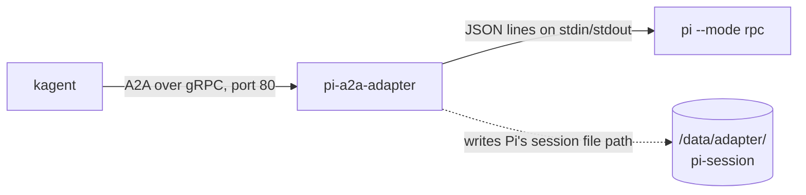

# Pi coding agent on kagent and Agent Substrate

Run the [Pi coding agent](https://github.com/earendil-works/pi) on [kagent](https://kagent.dev) 1.x and Agent Substrate, with [OpenRouter](https://openrouter.ai) as the model provider. Idle agents suspend to a snapshot and free their worker, then resume on the next message with the conversation intact.

This example is a migration of NVIDIA OpenShell's [Run Pi with OpenRouter](https://docs.nvidia.com/openshell/latest/tutorials/run-pi-with-openrouter) tutorial: the same Pi image, now behind a small adapter, with kagent resources in place of sandbox flags. It is part of [kagent-examples](../README.md). For Claude Code, which kagent supports out of the box and needs no adapter, see [`claude-code-from-openshell`](../claude-code-from-openshell/).

## What maps to what

| OpenShell tutorial | This example |
| :--- | :--- |
| `Dockerfile.pi` and `docker build` | The same Dockerfile plus the adapter, pushed to a registry and referenced **by digest** |
| Provider profile and credential for `openrouter.ai` | A `Secret` and a `ModelConfig`; the gateway allows the destination and injects the credential |
| `openshell sandbox create --from ... -- pi` | `Harness`, `AgentTemplate`, and `Agent` (`pi.yaml`), and a session per conversation |
| `openshell policy get` and `openshell logs` | Egress policy derived from the template, and the egress gateway logs |
| `--upload .:/workspace` | `kagent sandbox upload` for scratch sandboxes |
| A sandbox that lives until you delete it | Actors that suspend when idle and resume on the next request |
| Pi runs in a terminal (TTY) | `pi-a2a-adapter` speaks A2A to kagent and drives `pi --mode rpc` (the new work) |

## How it works

Pi is a terminal app, and kagent talks to agents over A2A. A small Go adapter sits in front of Pi and translates between the two.



- The adapter serves A2A on port 80 and `/readyz` on 8081 (kagent's Go ADK provides both), starts `pi --mode rpc`, and streams Pi's reply back as it arrives.
- An actor is cold-booted after every suspend, so the Pi process is new each time. The adapter keeps the conversation by recording Pi's session file on the durable `/data` volume and switching Pi back to it on the next start.
- The model call goes through Substrate's egress gateway. Pi sends a placeholder key, and the gateway swaps in the real one from a Kubernetes Secret, so the key never enters the actor.

## Layout

| Path | What it is |
| :--- | :--- |
| `adapter/` | The A2A-to-Pi adapter (`main.go`, `go.mod`, `go.sum`) |
| `Dockerfile.pi` | Builds the adapter, then Pi on `node:24-bookworm-slim` |
| `modelconfig-openrouter.yaml` | `ModelConfig` for OpenRouter (OpenAI-compatible) |
| `pi.yaml` | `Harness`, `AgentTemplate`, and `Agent` for Pi |
| `scripts/smoke-test.sh` | Runs a turn, waits for suspend, resumes, and checks recall |
| `sandboxtemplate.yaml` | Optional scratch `SandboxTemplate` that reuses the Pi image |
| `TROUBLESHOOTING.md` | Fixes for the errors you are most likely to hit |

## Prerequisites

- The base setup from the [repo README](../README.md#prerequisites): a cluster with Agent Substrate and kagent 1.x installed, plus `kubectl`, the `kagent` CLI, `kubectl-ate`, and `jq`.
- Docker, if you build your own image.
- An [OpenRouter API key](https://openrouter.ai/keys). The default model is a free one, so no credits are needed.

## Quickstart

```bash
# 1. Secret and model
export OPENROUTER_API_KEY=<your OpenRouter key>
kubectl create secret generic kagent-openrouter -n kagent \
  --from-literal PROVIDER_API_KEY="$OPENROUTER_API_KEY"
kubectl apply -f modelconfig-openrouter.yaml

# 2. The agent
kubectl apply -f pi.yaml
kagent agent get pi            # wait for READY = True; the first time takes a minute or so

# 3. Try it
kubectl port-forward -n kagent svc/kagent-controller 8083:8083 &
./scripts/smoke-test.sh
```

The smoke test creates a session, asks Pi to write a file, waits for the actor to suspend, then resumes it with a question that only works if the adapter restored the conversation. A passing run looks like this:

```text
== turn 1: create a file
Created substrate11793.txt with the word "substrate11793".
actor after turn 1: ACTOR_STATE_SUSPENDED <none>
== turn 2: resume and recall
You asked me to create substrate11793.txt containing the word "substrate11793".
PASS: suspend, resume, and conversation restore all work
```

To chat with the agent yourself, create a session and send tasks to it (the first command prints the ID that the second needs):

```bash
export SESSION_ID=$(kagent agent session create --agent pi -o json | jq -r '.session.id')
kagent agent invoke --session $SESSION_ID --task "Create hello.txt with a one-line greeting"
kagent agent session delete $SESSION_ID
```

### Use your own image

`pi.yaml` points at a prebuilt, public, multi-arch image (`linux/amd64` and `linux/arm64`), `hguerrero0/pi-agent`. It saves you a build, but building your own means you run exactly what is in this repo, and you control updates:

```bash
docker build -t <registry>/pi-agent:0.1 -f Dockerfile.pi .
docker push <registry>/pi-agent:0.1
docker inspect --format='{{index .RepoDigests 0}}' <registry>/pi-agent:0.1
```

Put the printed `<registry>/pi-agent@sha256:...` reference in the `workload.image` field of `pi.yaml` and `sandboxtemplate.yaml`. Substrate pins images by digest, so a tag or a local image will not work. The build needs network access to fetch the Go modules, and you can pin Pi with `--build-arg PI_VERSION=<version>` (it defaults to `latest`).

Check the image before you push:

```bash
docker run --rm --entrypoint pi <registry>/pi-agent:0.1 --version
docker run --rm --entrypoint ls <registry>/pi-agent:0.1 -l /usr/local/bin/pi-a2a-adapter
```

The adapter refuses to start outside kagent because it needs the agent card that kagent supplies. That is expected.

## Configuration

| Setting | Where | Notes |
| :--- | :--- | :--- |
| Model | `model:` in `modelconfig-openrouter.yaml` and `PI_MODEL` in `pi.yaml` | Keep the two the same. The default is the free model `nvidia/nemotron-3-ultra-550b-a55b:free`. Browse [OpenRouter models](https://openrouter.ai/models) for others, including more free ones (IDs ending in `:free`). |
| `OPENROUTER_API_KEY` | `pi.yaml` env | An inert placeholder (`kagent-credential-injected`). The egress gateway injects the real key from the `kagent-openrouter` Secret. Do not put your key here. |
| `PI_OFFLINE=1` | `pi.yaml` env | Stops Pi calling `pi.dev` for its model catalog at startup. Default-deny egress blocks that call with a 403, which is harmless but noisy in the gateway logs. |
| `PI_PROVIDER` | `pi.yaml` env | The Pi provider name, passed to `--provider`. |

## Scratch sandboxes (optional)

`sandboxtemplate.yaml` defines a disposable standalone sandbox that reuses the Pi image. It is for running commands and moving files, not for agents: the gateway denies all outbound connections from a standalone sandbox.

Enable standalone sandboxes first by setting the guest image digest, or the template fails with `PreparationFailed`. The digest below is for kagent `1.0.0-alpha7`:

```bash
helm upgrade kagent oci://ghcr.io/kagent-dev/kagent/helm/kagent \
  --version 1.0.0-alpha7 --namespace kagent --reuse-values \
  --set controller.sandbox.guestImage.digest=sha256:1821780ef01958f63cb9a1a1d9a175f7e386e7c72859dd29ab86d8644a47d2d4
```

If you scaled the worker pool with `kubectl scale`, this fails with a field conflict. Add `--set substrateWorkerPool.replicas=<current count>`. Then:

```bash
kubectl apply -f sandboxtemplate.yaml
kubectl wait --for=condition=Ready sandboxtemplate/pi-scratch -n kagent --timeout=120s
SANDBOX_ID=$(kagent sandbox create pi-scratch --request-id pi-scratch-1 -o json | jq -r '.id')
kagent sandbox exec $SANDBOX_ID -- node --version
```

Commands start in `/data/workspace`, the durable directory. Move files in and out, and suspend and resume the sandbox:

```bash
echo "# notes from the host" > notes.md
kagent sandbox templates
kagent sandbox upload $SANDBOX_ID ./notes.md /data/workspace/notes.md
kagent sandbox exec $SANDBOX_ID -- sh -c 'wc -c /data/workspace/notes.md > /data/workspace/out.txt'
kagent sandbox download $SANDBOX_ID /data/workspace/out.txt ./out.txt
cat out.txt                      # 22 /data/workspace/notes.md

kagent sandbox suspend $SANDBOX_ID
kagent sandbox resume $SANDBOX_ID
kagent sandbox exec $SANDBOX_ID -- cat /data/workspace/notes.md    # files under /data survive
kagent sandbox delete $SANDBOX_ID
```

`--request-id` makes `create` safe to retry: the same ID and inputs return the same sandbox, a new ID creates a second one, and reusing an ID with different inputs (such as a different `--ttl`) fails with `request_id was used for different input`. A sandbox expires on its own, one hour after creation by default (`--ttl` on `create` changes that), and activity does not extend it. Suspending interrupts whatever is running, so let a command finish first. The [standalone sandboxes docs](https://kagent.dev/docs/kagent/1.x/substrate-runtime/standalone-sandboxes/) list every Helm value and the full command set.

## Clean up

```bash
kubectl delete -f pi.yaml -f modelconfig-openrouter.yaml
kubectl delete secret kagent-openrouter -n kagent
kubectl delete -f sandboxtemplate.yaml --ignore-not-found
```

Delete any sessions you created with `kagent agent session delete <id>`, because each running actor holds a worker.

## Tested with

Validated end to end on 2026-10-06 on a local `kind` cluster (Kubernetes 1.37.0, arm64). The multi-arch image in `pi.yaml` was re-tested on the same cluster on 2026-10-07.

| Component | Version |
| :--- | :--- |
| Substrate (`substrate`, `substrate-crds` charts) | 0.3.0-alpha3 |
| kagent (`kagent`, `kagent-crds` charts) and CLI | 1.0.0-alpha7 |
| Worker image | `ghcr.io/kagent-dev/substrate/ateom-gvisor:v0.3.0-alpha3` |
| kagent Go ADK (adapter dependency) | commit `542e0a7a82f0f32d09c398f9c56319a3f617c93a` (`v1.0.0-alpha7`) |
| Go | 1.27.1 |
| Pi | 1.0.4 (`@earendil-works/pi-coding-agent`, `latest` at build time) |
| Node | 24 (`node:24-bookworm-slim`) |

What was run:
- The adapter builds and passes `go vet`, and the `go mod` commands in the Notes section reproduce `go.mod` and `go.sum` exactly.
- The Dockerfile builds and passes the image checks above.
- All manifests pass a server-side dry run against the kagent CRDs.
- Nine turns across three sessions completed, with each resume restoring the earlier conversation.
- OpenRouter calls succeeded through the gateway with the placeholder key, with no egress denials once `PI_OFFLINE=1` was set.
- The standalone sandbox flow ran end to end: create, exec, upload, download, suspend, resume, and delete.

These are alpha releases, so the pins will drift. Check the [kagent 1.x docs](https://kagent.dev/docs/kagent/1.x/) for current versions. The alpha8 CLI and Substrate 0.4.0-alpha1 were not tested.

## Troubleshooting

See [TROUBLESHOOTING.md](TROUBLESHOOTING.md) for the `input was not accepted` error, agents that forget earlier turns, and egress denials.

## Notes

- The actor runs as root (uid 0) inside its gVisor sandbox, so the `USER node` line in `Dockerfile.pi` does not decide file ownership at run time. The durable `/data` volume is empty and root-owned on first start, and the adapter creates `/data/workspace` and `/data/pi-agent/sessions` itself.
- The first cluster run used an earlier single-arch (arm64) build of the image, from an earlier revision of `Dockerfile.pi` that also created `/data/workspace` in the image. That makes no difference at run time, because the durable volume is mounted over `/data` and hides anything the image put there. The multi-arch image now in `pi.yaml` was then rolled out and passed `scripts/smoke-test.sh` on the same arm64 cluster. Its amd64 variant was only checked by starting `pi --version` under emulation. It has not run on an amd64 cluster.
- To recreate the adapter's module (Go 1.27 or later), pin the kagent ADK to the commit behind `v1.0.0-alpha7`, and repeat the `replace` that kagent uses:

  ```bash
  cd adapter
  go mod init example.com/pi-a2a-adapter
  go get github.com/kagent-dev/kagent/go@542e0a7a82f0f32d09c398f9c56319a3f617c93a
  go mod edit -replace github.com/agent-substrate/substrate=github.com/kagent-dev/substrate@v0.3.0-alpha3
  go mod tidy
  ```

- The adapter uses the same pattern as kagent's own Claude Code harness. Its dependencies are pinned to the `v1.0.0-alpha7` commit, and `go.mod` repeats the `replace` for the Substrate API types because Go ignores `replace` directives in dependencies.

## License

Licensed under the [Apache License, Version 2.0](../LICENSE).
